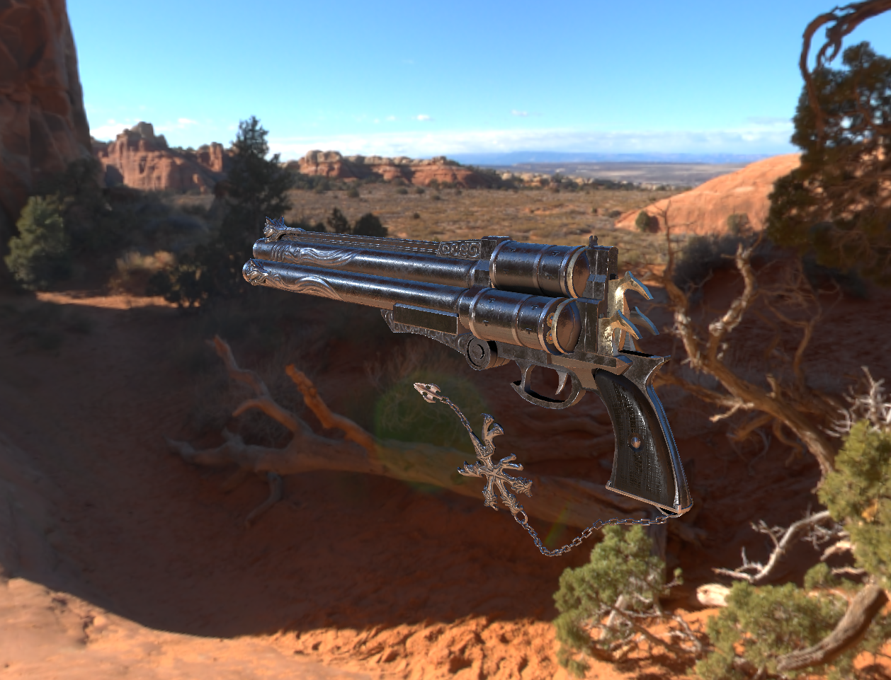

# YRenderLab

**Personal rendering pipline**

## PipLine WorkFlow

- [x] diffuse_bsdf material
- [x] standardPbr material
- [x] Raster
  - [x] ForwardRaster
  - [x] DeferredRaster
- [x] Architecture Build 
- [x] module loading
- [x] Normal Mapping
- [x] Sky Box
- [x] IBL
  - [x] Diffuse
  - [x] specular
- [x] CubeMap
- [x]  Light
  - [x] Direction Light
  - [ ] Point light
  - [ ] Spot Light
- [ ] Shadow
  - [ ] CSM/PCSS
    - [ ] Directional Light
    - [ ] Point Light
    - [ ] Spot Light
  - [ ]  Distance field Soft Shadow
- [ ] Antialiasing
  - [ ] TAA
- [ ] Matrix-MainCol
- [ ] Transform Parent

### SoftRHI
- [x] Coordinate Transformation
- [x] Matrix Caculation
- [x] Half Space Rasterization
- [x] BackFace Culling 
- [x] Homogeneous Culling
- [x] Texture Mapping
- [x] Barycentric Interpolation
- [x] Camera controller

### Path Tracer
Cpu implement

- [x] Building frameWork
- [x] Camera Trace
- [x] Antialiasing
- [x] Diffuse Material
- [ ] Metal Material

### Fix

- [x] delete Vertex shader  Error 
- [x] 第一次Draw Albedo信息丢失 //Texture bind and active error
- [x] deferredRender 1080P 窗口顶部有黑框 // init size error

#### Optimization

- [ ] VAO-Mesh容器，Texture-Image容器清理
- [ ] Render Resource Manager

### Tips

*Gbuffer layout*

**GLTexture::TexTureformat::TEX_GL_RGBA32F, //pixpos + roughness**
**GLTexture::TexTureformat::TEX_GL_RGBA32F, //normal + metallic**
**GLTexture::TexTureformat::TEX_GL_RGBA32F  //albedo + ao**

